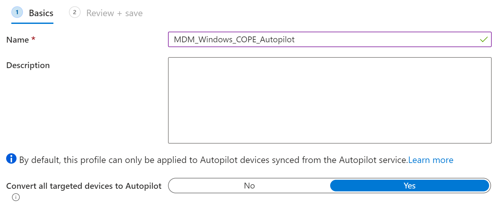
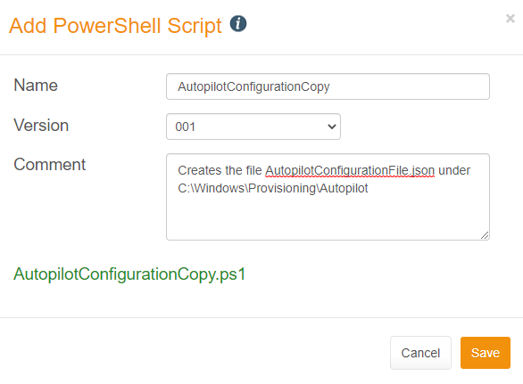
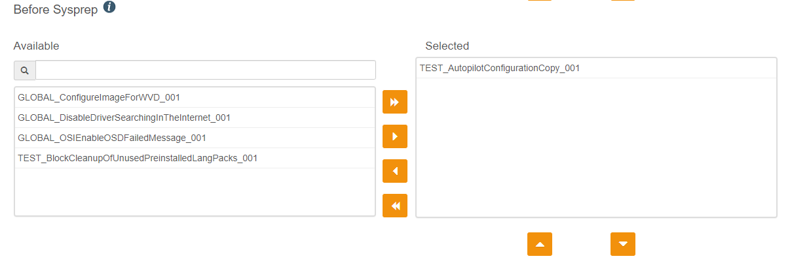

# WimAsAService AutopilotJSON
[1. Use Case](https://github.com/baseVISION/baseVISION.SyntaroWiki/blob/main/WimAsAService/WimAsAService_AutopilotJSON.md#use-case)  
[2. Getting the JSON File](https://github.com/baseVISION/baseVISION.SyntaroWiki/blob/main/WimAsAService/WimAsAService_AutopilotJSON.md#Getting-the-JSON-File)  
[- 2.1. Validating Your Autopilot Enrollment Profile](https://github.com/baseVISION/baseVISION.SyntaroWiki/blob/main/WimAsAService/WimAsAService_AutopilotJSON.md#validating-your-autopilot-enrollment-profile)  
[- 2.2. Retrieve your Autopilot JSON File](https://github.com/baseVISION/baseVISION.SyntaroWiki/blob/main/WimAsAService/WimAsAService_AutopilotJSON.md#retrieve-your-autopilot-json-file)  
[3. Adding the JSON File to your WimAsAService Image](https://github.com/baseVISION/baseVISION.SyntaroWiki/blob/main/WimAsAService/WimAsAService_AutopilotJSON.md#adding-the-json-file-to-your-wimasaservice-image)  
[- 3.1. Create the PowerShell-Script](https://github.com/baseVISION/baseVISION.SyntaroWiki/blob/main/WimAsAService/WimAsAService_AutopilotJSON.md#create-the-powershell-script)  
[- 3.2. Implement the Script in WimAsAService](https://github.com/baseVISION/baseVISION.SyntaroWiki/blob/main/WimAsAService/WimAsAService_AutopilotJSON.md#implement-the-script-in-wimasaservice)  


# Use Case

To use Autopilot with your newly staged devices that are based on a
WimAsAService WIM image we need to leverage the functionality of the
Autopilot Configuration JSON. The JSON itself describes the
configuration of the Windows Autopilot Enrollment Profile that you have
configured through the Microsoft Endpoint Manager admin center.
Normally, you enroll your new devices with the Hardware Vendor IDs
submitted by your vendor or manually by creating the .CSV with the
Get-WindowsAutoPilotInfo script. The new devices will then be assigned
to this autopilot profile manually or over a dynamic group membership
based on the ZTDId. Afterwards, the devices request and receive the
configuration JSON during the OOBE process.

In our case, we do not know on which set of hardware the WIM image will
be deployed to. You cannot assign an unknown device to your Autopilot
profile so these devices cannot retrieve the configuration automatically
during OOBE. To mitigate this problem, we can provide the autopilot
configuration manually by copying the JSON file to our Windows
installation during generation.
After we have provided the JSON file, the device will run through the
OOBE process as if it had been enrolled to Autopilot beforehand and
requested the JSON file from Azure. The sole difference being that we
have copied the JSON manually.

# Getting the JSON File  
Sadly, you cannot just download the JSON File
from the Microsoft Endpoint Manager admin center. To get to the file
instead, we need to use some PowerShell modules to retrieve it from
Azure directly via the Graph API.

## Validating Your Autopilot Enrollment Profile

| | |
|---|---|
|  | Before we retrieve our JSON file, we first must make sure that our Autopilot profile is configured correctly. Mainly, we want to make sure, that the flag “Convert all targeted devices to Autopilot” is set to Yes. |

## Retrieve your Autopilot JSON File

To get your specific JSON configuration file, run the following cmdlets
on any internet-connected client. (Azure AD Join is not needed)
**Installing the required modules**

``` PowerShell
Install-PackageProvider -Name NuGet -MinimumVersion 2.8.5.201 -Force
Install-Module AzureAD -Force
Install-Module WindowsAutopilotIntune -Force
Install-Module Microsoft.Graph.Intune -Force
```


**Retrieve the JSON file**

``` PowerShell
Connect-MSGraph
```


Login with your credentials to the Azure AD. If this is your first time
using Intune Graph APIs, you will also be prompted to enable read and
write permissions for Microsoft Intune PowerShell.

Export the AutopilotProfileJSON

``` PowerShell
Get-AutopilotProfile | ConvertTo-AutopilotConfigurationJSON | Out-File C:\Temp\AutopilotConfigurationFile.json -Encoding ASCII
```


**Important:** The file name must be named
AutopilotConfigurationFile.json in addition to being encoded as
ASCII/ANSI
**Important:** If you have multiple Autoenrollment Profiles, delete all
other profiles except the one you want to apply to your clients

# Adding the JSON File to your WimAsAService Image

Now that we have the JSON file we just need to add it to our new or
existing WimAsAService Image. To do so we first must create a PS1-script
which will copy the JSON file to the correct directory. We cannot solve
this via an application as we need to copy the file just before Sysprep.
Copying the file in an earlier stage can cause problems with the
generation of your WIM-image.

## Create the PowerShell-Script

Use the following template to create your version of the PowerShell
script. This example is the bare minimum required to successfully do the
job. The data that you have in your JSON needs to be copied into this
script template between the two ‘@

``` PowerShell
$AutopilotConfigurationFile =
@'
   <YOURJSONDATA>
'@

Out-File -InputObject $AutopilotConfigurationFile -FilePath $env:windir\Provisioning\Autopilot\AutopilotConfigurationFile.json -Encoding ASCII
```


In the end, the script looks something like this: (generalized data)

``` PowerShell
$AutopilotConfigurationFile = @'
{
    "CloudAssignedDomainJoinMethod":  0,
    "CloudAssignedDeviceName":  "Demo-%RAND:4%",
    "CloudAssignedAutopilotUpdateTimeout":  1800000,
    "CloudAssignedForcedEnrollment":  1,
    "Version":  2049,
    "CloudAssignedTenantId":  "a1b2c3-1234-wxyz-1234-12345678",
    "CloudAssignedAutopilotUpdateDisabled":  1,
    "ZtdCorrelationId":  "123456-abcd-4567-efgh-12345678",
    "Comment_File":  "Profile MDM_Windows_COPE_Autopilot",
    "CloudAssignedAadServerData":  "{\"ZeroTouchConfig\":{\"CloudAssignedTenantUpn\":\"\",\"ForcedEnrollment\":1,\"CloudAssignedTenantDomain\":\"M365x123456.onmicrosoft.com\"}}",
    "CloudAssignedOobeConfig":  1310,
    "CloudAssignedTenantDomain":  "M365x123456.onmicrosoft.com",
    "CloudAssignedLanguage":  "en-GB"
}
'@

Out-File -InputObject $AutopilotConfigurationFile -FilePath $env:windir\Provisioning\Autopilot\AutopilotConfigurationFile.json -Encoding ASCII
```

## Implement the Script in WimAsAService
| | |
|---|---|
|  | Navigate to the menu “Manage” in the WimAsAService portal and click on “PowerShell Scripts”. Here you can add your own script.Give it a fitting name, version number and description and upload the script that we created previously.
|  | Now we can add the script to the “Before Sysprep” section of the “PowerShell Script” options. This will copy our JSON data as the correctly named file to the correct folder.

Now you are done. Generate the WIM-file and deploy it to your devices.
On first startup, users will find themselves in the
Out-of-box-experience and can log in to your tenant. The device will be
automatically joined to your Azure AD and if you have set the flag that
we mentioned above, you will also see it in your Autopilot devices.