# WimAsAService Tutorials

[1. General Solution Overview](https://github.com/baseVISION/baseVISION.SyntaroWiki/blob/main/WimAsAService/WimAsAService_Tutorials.md#general-solution-overview)  
[2. Generate a WIM File](https://github.com/baseVISION/baseVISION.SyntaroWiki/blob/main/WimAsAService/WimAsAService_Tutorials.md#generate-a-wim-file)  
[3. Adding an Application](https://github.com/baseVISION/baseVISION.SyntaroWiki/blob/main/WimAsAService/WimAsAService_Tutorials.md#adding-an-application)  
[4. Configure your Azure Storage Account](https://github.com/baseVISION/baseVISION.SyntaroWiki/blob/main/WimAsAService/WimAsAService_Tutorials.md#configure-your-azure-storage-account)  
[5. Create an Azure Shared Image](https://github.com/baseVISION/baseVISION.SyntaroWiki/blob/main/WimAsAService/WimAsAService_Tutorials.md#create-an-azure-shared-image)  
[6. Manage File Tab](https://github.com/baseVISION/baseVISION.SyntaroWiki/blob/main/WimAsAService/WimAsAService_Tutorials.md#manage-file-tab)  
[7. Copy an existing Image Type](https://github.com/baseVISION/baseVISION.SyntaroWiki/blob/main/WimAsAService/WimAsAService_Tutorials.md#copy-an-existing-image-type)  
[8. Filter for Base WIM](https://github.com/baseVISION/baseVISION.SyntaroWiki/blob/main/WimAsAService/WimAsAService_Tutorials.md#filter-for-base-wim)  
[9. Use WebHooks for notifications](https://github.com/baseVISION/baseVISION.SyntaroWiki/blob/main/WimAsAService/WimAsAService_Tutorials.md#use-webhooks-for-notifications)  
[10. Activate multi-factor authentication](https://github.com/baseVISION/baseVISION.SyntaroWiki/blob/main/WimAsAService/WimAsAService_Tutorials.md#activate-multi-factor-authentication)  
[11. Use a custom autounattend.xml](https://github.com/baseVISION/baseVISION.SyntaroWiki/blob/main/WimAsAService/WimAsAService_Tutorials.md#use-a-custom-autounattendxml)  
[12. Uninstall Modern Apps (Appx / Store Apps)](https://github.com/baseVISION/baseVISION.SyntaroWiki/blob/main/WimAsAService/WimAsAService_Tutorials.md#uninstall-modern-apps-appx--store-apps)  
[13. Install Windows Features or Uninstall Windows Features](https://github.com/baseVISION/baseVISION.SyntaroWiki/blob/main/WimAsAService/WimAsAService_Tutorials.md#install-windows-features-or-uninstall-windows-features)  
[14. Using GLOBAL_OSIEnableOSDFailedMessage_001.ps1](https://github.com/baseVISION/baseVISION.SyntaroWiki/blob/main/WimAsAService/WimAsAService_Tutorials.md#using-global_osienableosdfailedmessage_001ps1)  
[15. OnPremises Customer Documents](https://github.com/baseVISION/baseVISION.SyntaroWiki/blob/main/WimAsAService/WimAsAService_Tutorials.md#onpremises-customer-documents)  

### General Solution Overview

There is a short overview Video, showing you the basic handling of the
Website:
<YouTube>https://youtu.be/eG0reI5Kpak</YouTube>  
<a herf="https://youtu.be/eG0reI5Kpak" target="_blank">Hello Worls!</a>  
 

[link](https://youtu.be/eG0reI5Kpak/?target=_blank)

### Generate a WIM File

The following graphic shows how your Image Types will be generated:
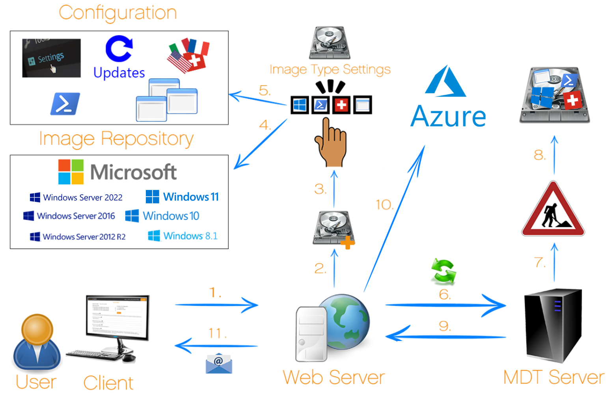 |

| | |
|---|---|
| 1   | You can access the WimAsAService Web interface through a usual Browser like Edge, Internet Explorer, Chrome or Firefox.                                                       
| 2   | On the Web interface create a new Image Type.
| 3   | Before the Image can be created it has to be configured. First of all, give it a Name.
| 4   | Choose one of the Images, which is available in our Image Repository.
| 5   | Specific configuration can be applied to the chosen Operation System. Self-Created PPKG Files can be uploaded, Modern Apps can be uninstalled, Windows Features can be activated or deactivated, even undesired Windows Updates can be excluded. There are applications placed at the disposal by baseVISION AG, or you can upload your own Applications. Insert the language packages you want into your WIM (Multiple can be added). PowerShell scripts can also be implemented into the WIM file. If you have some special desires during the WIM creation your PowerShell scripts can be added to the Task sequence steps “Before Apps, After Apps and Before Sysprep”. Last of all you can define a schedule for automatic WIM creation. When you’re done save your Image Type.
| 6   | If you press the Button “Generate Wim” all essential Information will be prepared for the MDT Server. If the MDT Server is busy, the Task will be queued or otherwise it will start immediately. You will be informed with an E-Mail when your creation process has been started or queued.
| 7   | The MDT Server starts the creation process. The default Task Sequence is adjusted based on your configuration. With aid of a Virtual Machine your deployment process will be started.
| 8   | The WIM file will be finished with the configuration you set.
| 9   | At the End of the deployment Process your Image will be available through the Webinterface. You can get the Image in your required file format (ISO/VHD).
| 10  | Additionally, you can upload your images also to Azure.
| 11  | If everything is done you receive an E-Mail. In there is stated, that the WIM File is ready to download. 

### Adding an Application

There is a short Video, showing you how to add an Application:  
<YouTube>https://youtu.be/Hd7r1FFIYUo</YouTube>

You can trigger any kind of Application Installation, as long that it can be executed silently.  
If you want to add an Application, you first need to create a ZIP File that contains the Application Files. The File you want to execute needs to be in the Root Folder of your ZIP File.

**How to fill out the “Add new Application” Form:**

**Manufacturer** = The Name of the Manufacturer (example Microsoft)  
**Product Name** = The Name of the Application (example OfficeProPlus)  
**Version** = The Version of the Application (example 2016)  
**Package Version** = You can have Multiple Versions of a Package for the same Application. Select the Package Version  
**Architecture** = The Architecture of the Application. x99 stands for an Application that can be installed on both platforms (x86 and x64)  
**Type** =P stands for a physically installed Application (MSI, EXE, etc.). V stand for a Virtual Application (App-V, ThinApp, etc.)  
**Language** = The Language of the Application. Select ML if the Application can be used in more than one Language.  
**Command Line** = The Command Line Parameters required to install the Application silently and without User interaction.  

**Example Command line for the installation of an MSI-File:**  
msiexec /i Microsoft-CMTrace-5.0.7782.1000.msi /qn REBOOT=ReallySuppress
/L\*V "C:\Windows\Logs\Microsoft-CMTrace-5.0.7782.1000.log"

**Example Command line for the execution of a VBS:**  
cscript install.vbs

**Example Command line for the execution of a PowerShell Script:**  
powershell -executionPolicy bypass -file install.ps1

**Example Command line for the execution of a Batch:**  
install.bat

### Configure your Azure Storage Account

| | |
|---|---|
|  | If you do not already have a storage account or want to create a dedicated storage account for your WimAsAService Images, create a new storage account in the Azure portal. Choose your already existing resource group or create a new one. Choose a fitting storage account name (lower case no special symbols and unique) and click "Review + Create" on the bottom of the screen. All other settings can be left on default or modified to your liking. |
| 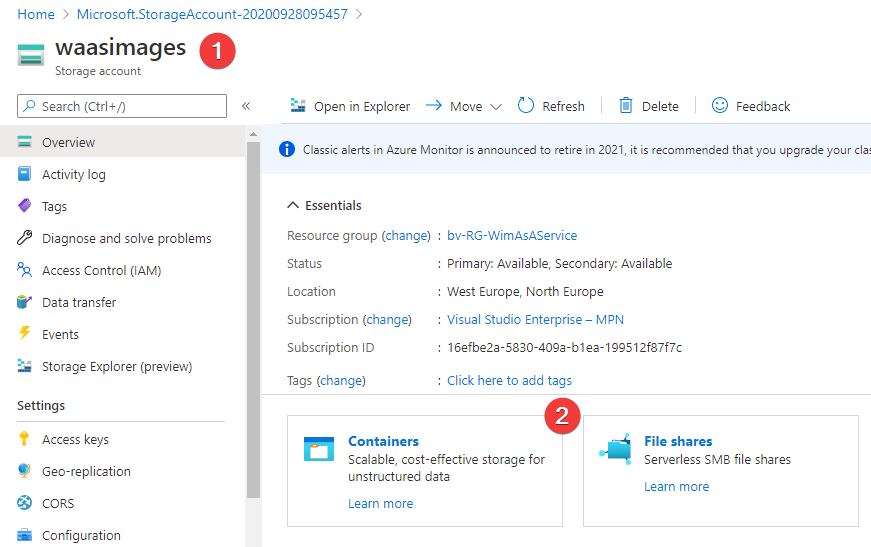 | After you have successfully created your storage account, navigate to the new resource (1) and add a container (2). Choose a fitting name and leave the rest of the settings to default. |
| 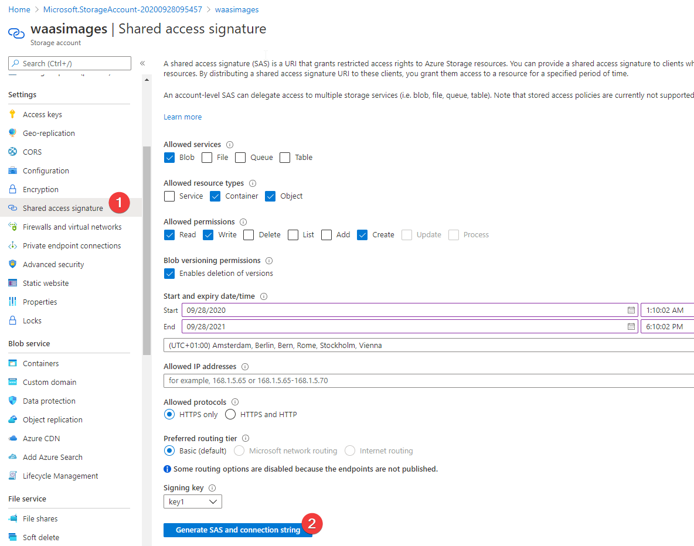 | Now you have a storage account with a container where we will copy your images to. To allow our copy access, we need to generate an SAS token. To do so, navigate to "Shared Access Signature" on your storage account and configure the shared access signature as depicted in the screenshot. This is the minimum set of permissions that we need. We suggest that you have the images in a separate container or storage account so access over the SAS token is kept to a small scope. We also advice that you set the expiry date for a year and track the date with the SAS token like a certificate for annual renewal. You cannot retrieve the SAS token at a later date over the portal. |
| 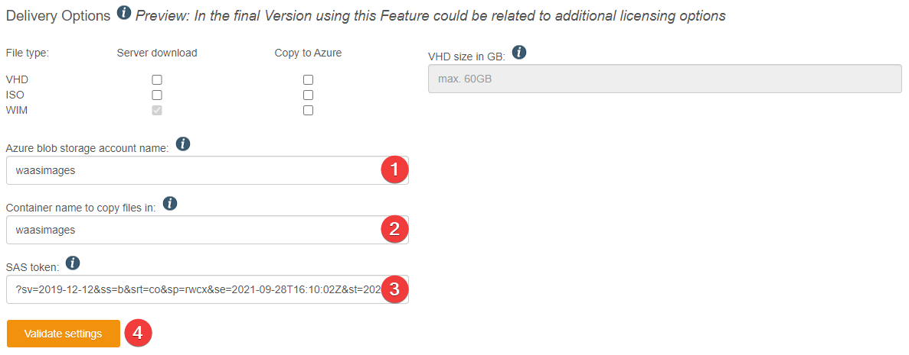 | Navigate to your image type in WimAsAService and input all the necessary information at the bottom of the configuration page. Please note that if you select one of the "Copy to Azure" checkboxes, inputting this data is required. |
| 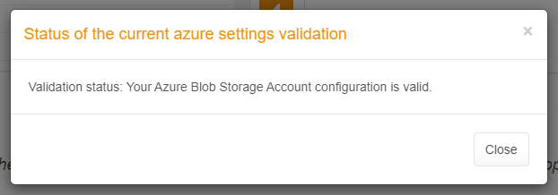 | After you have input all the data you need to validate the settings. If done so correctly, the validation should pass and you can start to generate or copy your images directly to Azure. |
| 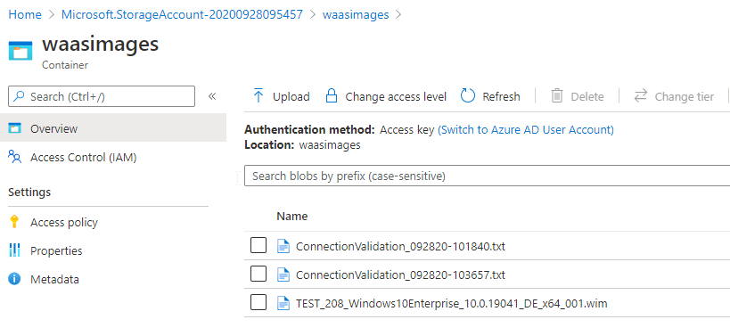 | After an image creation process or copy job over "manage files" has finished, you should see the WIM, VHD and or ISO files in your storage account. The "connectionvalidation.txt" files are created by the validation process. We cannot delete these files because we do not require delete permissions on your storage account. These can be deleted manually if needed. |

### Create an Azure Shared Image

| | |
|---|---|
| 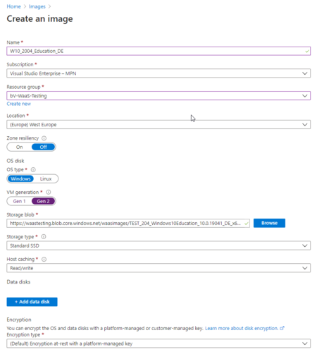 | After you have successfully generated an Image and copied the VHD-file to your Azure Storage Account, there might arise a question. What to do next with this file in Azure? There are different kinds of use cases. You can use the file as a source of new host pools in WVD or new VMs that you want to host in the cloud. One recommended action is, to create an Azure Image. You can use this Image to create new VMs or host pools for WVD. Adding the Images to a Shared Image Gallery, you can enable further functionality like version and access control. To create a new image, search for "Images" in Azure and select "Create an Image". Here you can input the necessary data and select the VHD file from your storage account under "Storage blob". Of course, you could also copy the URI directly from the VHD-file. |
| 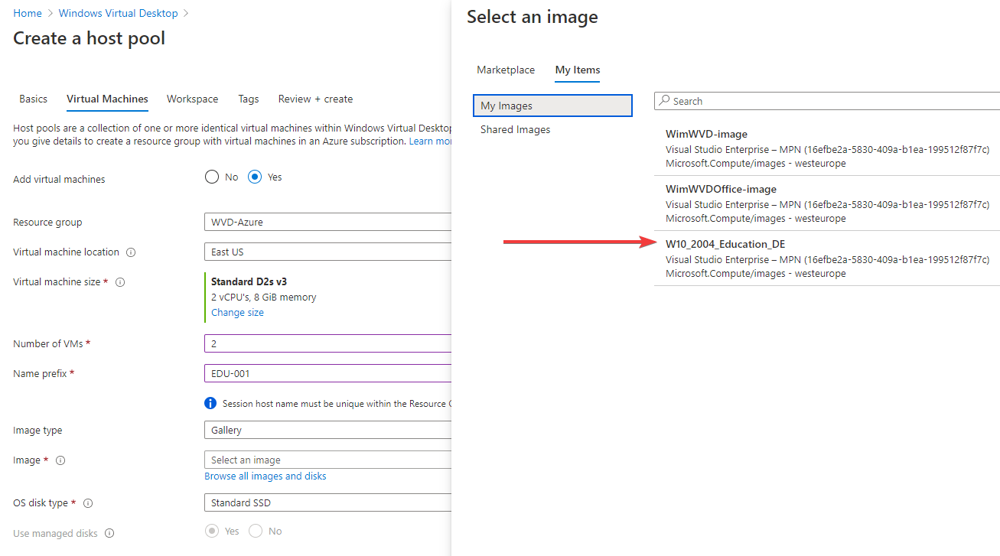 | Now you can use your custom image, instead of the Microsoft Marketplace images, as a basis for your new host pool or virtual machine. With this you can easily customize your WVD or VM deployment with the numerous options delivered by WimAsAService. |

### Manage File Tab

With the release of WimAsAService 4.0 we have reworked the "Manage Files" site and added some new functionality to help accommodate the possibilities of our new delivery options. You will find the "new" site where you have previously downloaded your image.  

Here we will quickly walk you through all the options you have:

| | |
|---|---|
| 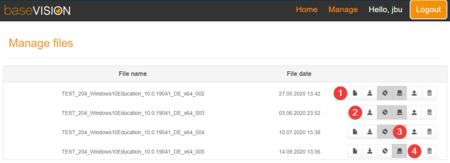 | 1. Download the documentation of your image 
2. Download your image in the available format (unavailable types are greyed out) Download Icon: Download WIM file Disk Icon: Download ISO file Harddisk Icon: Download VHD file  
3. Upload files to your configured Azure Storage Account. In a popup you can choose which file types should be uploaded
4. Delete the image version. This deletes all files associated with this image version!

### Copy an existing Image Type

| | |
|---|---|
| 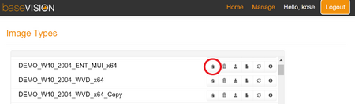 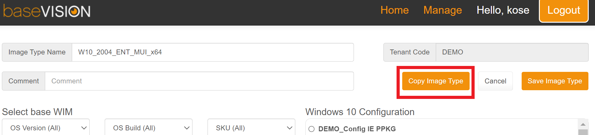 | An Image Type can be created in different ways. If you want to create a Image Type, which is similar to a already existing one, but with minor changes, you can copy the Image Type. The desired image can be copied in two ways. Either by clicking the copy button in the Image Type overview or by pressing the copy Image Type button in the Image Type settings. Once you copied the Image Type you'll be redirected to the add Image Type page with already pre-filled values from the Image Type you selected in advance. |

### Filter for Base WIM

| | |
|---|---|
| 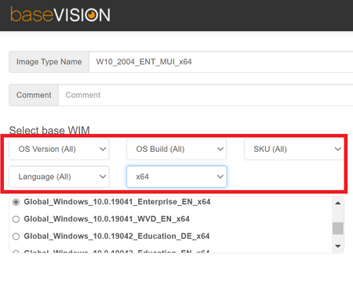 | There are many Base WIMs available which makes it difficult to find the right one at some point. To avoid searching too long and make searching more comfortable, you can use the filters. Filters can be found in the image type settings right above the Base WIM selection. The filters can be combined in any different ways to only show the images you want. |

### Use WebHooks for notifications

| | |
|---|---|
|  | We offer you to get notifications directly to your preferred webhook as well. Webhooks can be used for various purposes. For example, to automate processes in AVD after a new image has been uploaded or automatically download WIM files from Azure and then import them into Config Manager and much more.Therefore, navigate via "Manage" to "User / Tenant Settings". In the "Tenant Settings" you can enter the webhook address under "Webhook URL" and verify the URL with the Test Webhook button. If the test is successful, the following message appears under the enterd URL: "Webhook URL configuration is valid.If you would like to get notifications to the previously validated Webhook, you have toggle the "Notification to Tenant Webhook" check box.Save the configuration with the Save button and your settings will be applied. |

#### WebHook Data Reference

  
    {
    "message": "Message Text",       
    "data": {
                "blobstorage": "Name of your StorageAccount",
                "blobcontainer": "Name of your Blob Container",
                "FileName": "Name of VHD File"
       },
       "Requester": "Username in WaaS service portal",
       "dateTimeStamp": "[Timestamp]",
       "messageType": "success",
       "messageShort": "VHD Upload",
       "ImageTypeID": "[Image Type ID]",
       "ImageTypeName": "[Image Type Name]",
       "messageSubject": "Your VHD upload for the ImageType [Image Name] was successful",
       "WaaSVersion": "Version of the WaaS service"
    }  
 The following data will be sent to the configured Webhook endpoint. Not all of these values are always provided. For example, the object "data" does not contain any information for certain notifications.
To react correctly in the code that is executed behind the webhook, we suggest that you at least are checking two values. First, as a rule, tasks are only executed if they were successful, so we have to check the "messageType" if its value is "success". And then in the "messageShort" the process is mentioned (e.g., WIM Creation, ISO Upload, etc.). This will filter out the informational and failed messages.

**Possible messageType values**

- success
- informational
- error

**Possible messageShort values**

- WIM Creation / WIM Upload
- VHD Generation / VHD Upload
- ISO Generation / ISO Upload |

### Activate multi-factor authentication

| | |
|---|---|
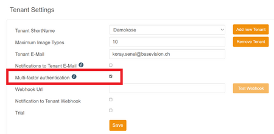 | To make the sign-in more secure, you can activate MFA (multi-factor authentication). Navigate via "Manage" to "User / Tenant Settings". In the "Tenant Settings" you can then simply check the "Multi-factor authentication" checkbox. Save the configuration with the Save button and your settings will be applied. The next time someone wants to sign in to your tenant, another page will appear after entering the username and password, asking for the numerical code that was sent to you by email. |

### Use a custom autounattend.xml

The following is a demo template as an example of such a
Autounattend.xml. Please at least adjust the two
"baseVISION_DemoOrganisation" entries in the file, with your
organisations name.

| | |
|---|---|
| 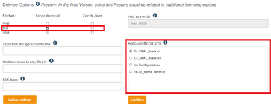 | With the Autounattend.xml function, Windows setups from iso files can be "easily" automated. Once you have defined your image, you can select the Autounattend.xml file in the "Delivery options" edit area. Watch out! Autounattend.xml files can only be loaded if ISO generation is activated. |
| 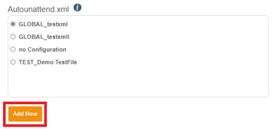 | If you want to upload a new xml file, you can do this in two ways. One way is directly in the Image Type definition by clicking on "Add New" under Autounattend.xml. |
| 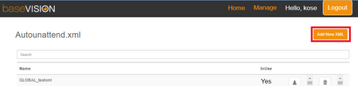 | The other way is via Manage/Autounattend.xml by selecting "Add New XML". |
| 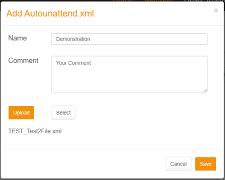 | In both ways, the field to upload the xml appears. Enter a name that you prefer and add a comment if you desire. With the "Select" field you can select your xml and afterwards you have to click on "Upload". When everything has been entered and the xml has been uploaded, you can save the whole process by clicking on "save". |
| 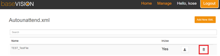 | If you want to delete your xml you can navigate to Manage/Autounattend.xml and delete the desired xml with the delete button. By confirming the following control field, the xml will be definitively deleted. If the xml is still in use, it will also be displayed in the control field. |

### Uninstall Modern Apps (Appx / Store Apps)

| | |
|---|---|
| 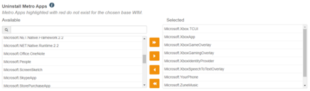 | With WimAsAService 4.0 we provide you an easier way, to uninstall unwanted metro apps. We create a list of available Metro Apps to uninstall for all supported images based off the lists down below. You can select apps to be uninstalled like you would select your applications. Only Apps that can be uninstall in this specific type of base image will show up on your list to not create any compatibility errors while generating your image. |

Lists of the Modern App Names and if they can be uninstalled:

**10.0.22631.0 /W11 23H2**  
  
  
  

**10.0.19045.0 /22H2**  
  
  
  
  
  

**10.0.22621.0 /W11 22H2**  
  
  
  

**10.0.19044.0 /21H2**  
  
  
  
  
  
  

**10.0.22000.0 /W11**  
  
  
  

**10.0.20348.0 /Server 2022**  
  
  

**10.0.19043.0 /21H1**  
  
  
  
  
  

**10.0.19042.0 /20H2**  
  
  
  
  

**10.0.18363.0 /1909**  
  
  
  
  

**10.0.17763.0 /1809**  
  
  
  
  

### Install Windows Features or Uninstall Windows Features

When entering the Feature Names this must be done with case
sensitivity.

**Attention:When adding NetFx to a Server always make sure you add the
corresponding ServerFeatures first**
(e.g. NetFx3ServerFeatures,NetFx3)

Lists of the Feature Names and their default Install state you find
here:

**10.0.22631.0 / W11 23H2**  
  
  
  

**10.0.19045.0 / 22H2**  
  
  
  
  
  

**10.0.22621.0 / W11 22H2**  
  
  
  

**10.0.19044.0 / 21H2**  
  
  
  
  
  
  

**10.0.22000.0 / W11**  
  
  
  

**10.0.20348.0 / Server 2022**  
  
  

**10.0.19043.0 / 21H1**  
  
  
  
  
  

**10.0.19042.0 / 20H2**  
  
  
  
  
  
  

**10.0.18363.0 /1909**  
  
  
  
  
  
  

**Windows-Server-2019**  
  
  
  
  

**10.0.17763.0 /1809**  
  
  
  
  

**Windows-Server-2016**  
  
  

### Using GLOBAL_OSIEnableOSDFailedMessage_001.ps1

If you are using the GLOBAL_OSIEnableOSDFailedMessage_001.ps1 you will also need an other Script (OSDEnableOSDMessage.ps1) within your own OSD Task Sequence.  
The script GLOBAL_OSIEnableOSDFailedMessage_001.ps1 will write a Failed Message to the registry.  
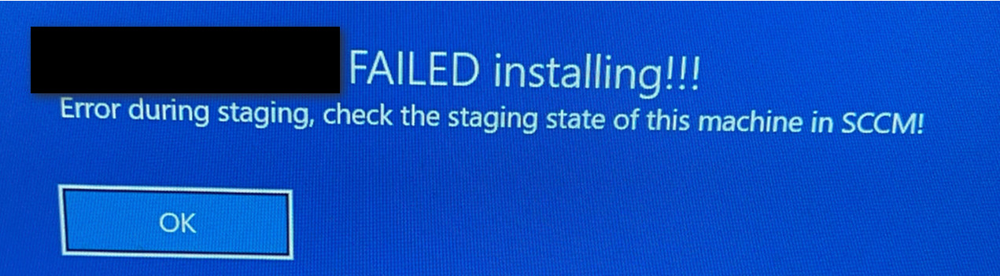  
At the end of your own Task Sequence, you will have to enter the Script OSDEnableOSDMessage.ps1  
<https://github.com/ThomasKur/ModernAndSecureWorkplace/blob/master/ConfigMgrOSD/OSDEnableOSDMessage.ps1>

How to use the Script OSDEnableOSDMessage.ps1 is mentioned in this blog post:  
<https://www.wpninjas.ch/2019/05/enhanced-os-deployment-end-message/>

So the idea is that when you TS crashes for any reason and the user then logs in to his device he will get the above failed Message. If the TS went trough ok the user will get a success message when login in. Written by OSDEnableOSDMessage.ps1

### OnPremises Customer Documents

If you are a WimAsAService OnPremises Customer you can find here some helpful Documentation:

**Adding baseWIMS,LanguagePacks and FeaturesOnDemand**  
  

**Additional Information to Add Windows 11 23H2 BaseWIMs, Language Packs and Features on Demand**  
  

**Additional Information to Add Windows 10 22H2 BaseWIMs, Language Packs and Features on Demand**  
  

**Additional Information to Add Windows 11 22H2 BaseWIMs, Language Packs and Features on Demand**  
  

**Additional Information to Add Windows 10 21H2 BaseWIMs, Language Packs and Features on Demand**  
  

**Additional Information to Add Windows 11 BaseWIMs, Language Packs and Features on Demand**  
  

**Additional Information to Add Windows 10 21H1 BaseWIMs, Language Packs and Features on Demand**  
  

**Additional Information to Add Windows 10 20H2 BaseWIMs, Language Packs and Features on Demand**  
  

**Additional Information to Add Windows 10 1909 BaseWIMs, Language Packs and Features on Demand**  
  

**Additional Information to Add Windows 10 1709 BaseWIMs, Language Packs and Features on Demand**  
  
